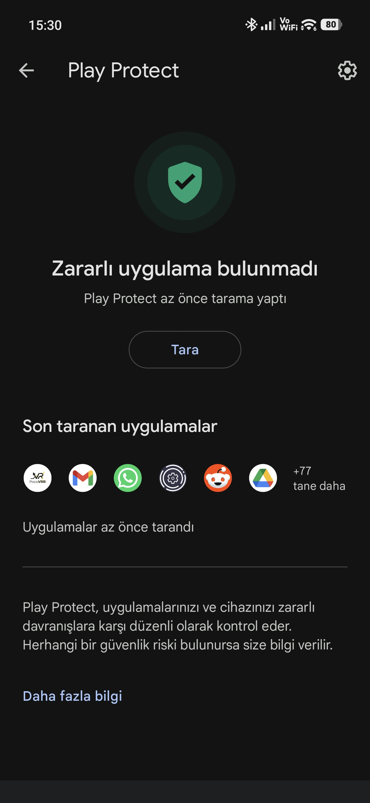

# PocoVRR — Poco X8 Pro Max / HyperOS 3 VRR Motoru

[](https://github.com/zewzack)
[](https://github.com/zewzack/PocoVRR)

PocoVRR, Poco X8 Pro Max (LTPS Panel) ve HyperOS cihazlar için özel olarak geliştirilmiş, akıllı ve optimize edilmiş bir **Yenileme Hızı (VRR) Kontrolcüsü**dür. 

## 🚀 Öne Çıkan Özellikler

- **Akıllı Geçiş:** Parmak ekrana değdiği an 120 Hz, hareketsizlikte belirlediğiniz süre sonunda (1s-3s) Min Hz (60, 90, 120).
- **Powerkeeper Koruması:** Sistem servislerinin (Powerkeeper) yenileme hızını düşürmesini engelleyen **Guard Loop** ve **ContentObserver** mekanizması.
- **Tam Ekran Deneyimi:** Tamamen siyah ve uçtan uca (Edge-to-Edge) modern arayüz tasarımı.
- **Düşük Gecikme:** Erişilebilirlik servisleri üzerinden dokunma ve kaydırma eventlerini anlık yakalama.

---

## 🛠️ Kurulum Rehberi (ÖNEMLİ)

Uygulamanın çalışması için sistem ayarlarını değiştirme yetkisine sahip olması gerekir. Bu yetki sadece bilgisayar üzerinden bir kez verilebilir.

### 🛡️ Neden Bu Kadar Fazla İzin Gerekiyor?

<details>
<summary><b>Detaylı Güvenlik ve Şeffaflık Açıklaması (Tıklayın)</b></summary>

Android ekosisteminin geçmişinde, özellikle eski nesil cihazlarda son kullanıcıları riske atan birçok zararlı yazılım ve güvenlik açığı mevcuttu. Bu durum, teknik bilgi birikimi kısıtlı olan veya Android ekosistemine uzak kullanıcıların Android cihazları "güvensiz" olarak nitelendirmesine yol açmıştır.

Google'ın güncel Android uygulama ve sürüm politikaları, cihazın işleyişini veya düzenini etkileyebilecek en küçük eylemlerde dahi son kullanıcının kesin ve bilinçli onayını şart koşmaktadır. Bu çok aşamalı işlem adımları (ADB komutları, Erişilebilirlik onayları vb.), kullanıcı güvenliğini en üst düzeyde korumayı hedefler. Biz geliştiriciler, bu süreçlerin kullanıcı deneyimini zaman zaman zorlaştırdığının farkındayız; ancak bu adımlar sistemin modern koruma mekanizmasının bir parçasıdır.

</details>

### 1. Adım: Telefondan Hazırlık
1. **Ayarlar > Telefon Hakkında** kısmına gidin ve **OS Sürümü** (veya MIUI Sürümü) üzerine 7 kez dokunarak **Geliştirici Seçeneklerini** açın.
2. **Ek Ayarlar > Geliştirici Seçenekleri** yolunu izleyin.
3. Şu üç seçeneği de aktif edin:
   - **USB Hata Ayıklama (USB Debugging)**
   - **USB Hata Ayıklama (Güvenlik Ayarları) / USB Debugging (Security Settings)** *(MIUI/HyperOS için kritiktir)*
   - **USB üzerinden yükle**

### 2. Adım: Play Protect Uyarısını Geçme
**PocoVRR**, temel işlevlerini yerine getirebilmek adına `WRITE_SECURE_SETTINGS` ve Erişilebilirlik Servisi gibi sistem düzeyinde kritik yetkiler talep etmektedir. Bu yetkiler nedeniyle Google Play Protect, uygulamayı "Tanımlanamayan Yayıncı" olarak işaretleyip yükleme sırasında bir uyarı çıkartabilir veya yüklemeyi engelleyebilir.

**🛡️ Play Protect Uyarısını Geçme:**
1. Play Store uygulamasını açın ve sağ üstteki profil simgenize dokunun.
2. **Play Protect > Ayarlar (Dişli çark)** kısmına girin.
3. **"Uygulamaları Play Protect ile tara"** seçeneğini geçici olarak kapatın.
4. PocoVRR APK dosyasını yükleyin. Yükleme bittikten sonra bu ayarı tekrar açabilirsiniz.

Uygulamanın bu uyarıyı vermesi tamamen talep ettiği sistem yetkileriyle ilgilidir ve cihazınız için herhangi bir güvenlik riski oluşturmaz. Uygulama tamamen **açık kaynak kodlu** olup, şeffaf bir şekilde incelenebilir ve **MIT Lisansı** ile korunmaktadır.



### 3. Adım: Bilgisayardan Yetkilendirme (ADB)
1. Bilgisayarınıza [Android Platform Tools (ADB)](https://developer.android.com/tools/releases/platform-tools?hl=tr) paketini indirin ve bir klasöre çıkartın.
2. Telefonunuzu USB kablosuyla bilgisayara bağlayın. Telefondan "Dosya Aktarımı" modunu seçin ve ekranda çıkan "USB Hata Ayıklama" uyarısına **"Her zaman izin ver"** diyerek onay verin.
3. ADB klasörünün içindeyken (adb.exe dosyasının olduğu yerde) boş bir yere **Shift + Sağ Tık** yapıp "PowerShell penceresini buradan açın" veya "Terminal aç" deyin.
4. Terminal ekranına şu komutu kopyalayıp yapıştırın ve Enter'a basın:

```bash
./adb shell pm grant com.zewzack.pocovrr android.permission.WRITE_SECURE_SETTINGS
```

### 4. Adım: Uygulama İçi İzinler
Bilgisayardaki işlem bittikten sonra uygulama içindeki şu izinleri de sırasıyla verin:
- **Kısıtlı Ayarlara İzin Ver:** Uygulama ayarlarından bu izni aktif etmeden Erişilebilirlik izni verilemez.
- **Erişilebilirlik Servisi:** PocoVRR'ı "Yüklü Uygulamalar" altından aktif edin.
- **Otomatik Başlatma:** Uygulamanın sistem tarafından kapatılmaması için izin verin.
- **Pil Kısıtlaması:** Pil tasarrufu ayarını **"Kısıtlama Yok"** olarak değiştirin.

---

## ⚙️ Uygulama Ayarları

- **Minimum Hz:** 30 (Deneysel), 60, 90, 120. (Pil tasarrufu ve akıcılık dengesi)
- **Maximum Hz:** 60, 90, 120. (Etkileşim anındaki hız)
- **Bekleme Süresi (Idle):** Hareketsizlikten kaç saniye sonra Hz düşürüleceği (1s, 2s, 3s).

---

## 🖥️ Teknik Detaylar

PocoVRR, HyperOS'un özel secure settings anahtarlarını kontrol eder:
- `miui_refresh_rate`
- `user_refresh_rate`

Uygulama geçişlerinde veya sistem müdahalelerinde 500ms boyunca her 100ms'de bir değeri kontrol eden ve hedef değerde tutan bir **Guard** mekanizmasına sahiptir.

---

## 👨‍💻 Developer
**@zewzack**

---

*Bu proje açık kaynak olarak paylaşılmıştır. Herhangi bir batarya veya ekran süresi sorunu oluşturmaz, aksine statik görüntülerde Hz düşürerek pil ömrüne katkı sağlar.*
